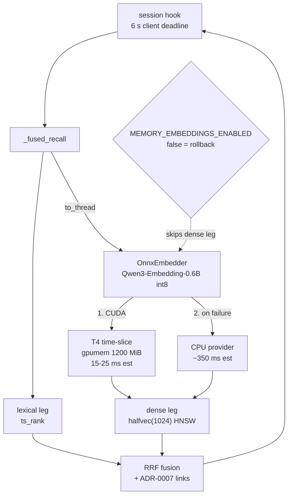

# Plan: GPU-served query embeddings for claude-memory recall

**Status:** done · **Date:** 2026-08-31, execution log 2026-09-01 · **Owner:** Viktor Barzin

Recall currently spends most of its time embedding the query on a CPU, and about
one recall in fifteen takes longer than the client is willing to wait. This plan
moves the embedding to the Tesla T4 on `k8s-node1`, and takes the opportunity to
change the model to one that understands the Bulgarian content already in the
corpus.

## Why now

```stats
0.95 s | recall p50
4.98 s | recall p90
6.5 % | recalls lost to the 6 s deadline
6.1 % | memories containing Cyrillic
```

Measured on 2026-08-31 from the live pod and Prometheus, over 647 recalls across
the pod's 3d3h lifetime:

| | recall latency |
|---|---|
| p50 | 0.95 s |
| p90 | 4.98 s |
| p99 | ≥ 10 s |
| mean | 1.97 s |
| over 6 s, the hook's deadline | **6.5 %** of recalls (42 of 647) |
| over 10 s | 3.9 % (25 of 647) |
| server-side errors | 0 |

The server raises nothing. `memory_recall_errors_total` has never been
incremented. What fails is the client: `homelab-memory-recall.py` sets
`RECALL_TIMEOUT_S = 6`, so 6.5 % of recalls return nothing at all to the session.
`~/.claude/tmp/memory-recall-errors.log` holds 247 such timeouts since
2026-07-11, 35 of them in the three days to 2026-08-31.

Two measurements locate the cost:

- `embed_query` takes **0.25 s to 0.9 s** inside the pod. The image ships
  `torch 2.13.0+cpu` and `embeddings.py` pins `device="cpu"`, so every recall runs
  a 335M-parameter model on a CPU, which matches the observed p50 of 0.95 s.
- A cold model load takes **166 s**. Readiness is not gated on a warm model, so
  after any restart the first recalls exceed the deadline until the load finishes.

The tail above 6 s is less firmly explained. The pod averages 0.02 cores, shows no
CFS throttling, and `recall.py` already runs the embed off the event loop via
`asyncio.to_thread`, so the working hypothesis is CPU-bound embeds colliding on a
shared 8-core node. This plan does not depend on that hypothesis being right,
because an expected GPU embed of 15 ms to 25 ms sits far enough below the 6 s
deadline that contention on this scale would not reach it.

### A quality gap, separate from speed

`BAAI/bge-large-en-v1.5` is an English-only model. Counted across the whole
corpus on 2026-09-01, **663 of 10,914 memories (6.1 %) contain Cyrillic**,
mostly Bulgarian technical notes, and the share is rising: **16.5 % of the 400
most recent**. Those are currently embedded by a model with no representation
for them, which the lexical leg partly covers and the dense leg does not.
Changing model addresses this independently of latency.

(An earlier draft said 9.2 %, from a 400-memory sample rather than the full
count. 6.1 % is the corpus figure and 16.5 % the recent rate.)

The dense leg is worth keeping. `memory_recall_dense_only_top5_total` is 672
against 647 recalls, so on average more than one served top-5 result per recall
is one the lexical leg alone would not have surfaced.

## Decisions

Settled in the grilling session of 2026-08-31.

| # | Decision | Rationale |
|---|---|---|
| 1 | VRAM governance is out of scope | Handled by a separate agent. This plan treats free VRAM as a precondition for its final step only. |
| 2 | Model becomes `Qwen/Qwen3-Embedding-0.6B` | Native 1024-d, so `halfvec(1024)` and the HNSW index are unchanged. Apache-2.0. Multilingual, which addresses the 6.1 %. 509M parameters. |
| 3 | Serving is in-process `onnxruntime-gpu` | One library, one model artifact, provider list `CUDA` then `CPU`. `torch` and `sentence-transformers` are removed. Chosen for simplicity over a separate TEI service, accepting that requesting a GPU hard-pins the pod to node1. |
| 4 | CPU fallback is the same ONNX model on the CPU provider | One vector space, no ranking incoherence, and the fallback is the same code path with a different provider. |
| 5 | Re-embed is in-place over the existing column | No schema change is needed at 1024-d. |
| 6 | Rollback is `MEMORY_EMBEDDINGS_ENABLED=false` | An in-place re-embed leaves no old vectors to restore, so rollback uses the flag instead. `recall.py` documents that path as a true no-op to lexical FTS. |
| 7 | Model file is baked into the image | Pod start needs no network and no PVC; the version is pinned by the image tag. |
| 8 | Build behind the flag now, flip when VRAM frees | Decouples this work from the VRAM stream. |
| 9 | Declared budget is `viktorbarzin.me/gpumem: 1200` | ~500 MiB int8 weights, ~300 MiB CUDA context, plus onnxruntime arena and slack. |
| 10 | Target is recall p90 under 500 ms; the 6 s hook timeout is unchanged | Generous against an expected GPU p50 near 20 ms and a CPU fallback near 350 ms, so it fires on regressions rather than noise. |
| 11 | Alerting covers recall only | VRAM alerting belongs to the ADR-0016 stream. |
| 12 | The eval set gains a Cyrillic stratum | The multilingual claim gets measured rather than assumed. |

Two options were considered and not chosen. A dedicated
`text-embeddings-inference` service would keep claude-memory portable across
nodes, at the cost of a second deployment, an experimental Turing image, and two
numerically different embedding paths. A server-side deadline degrading to
lexical results would remove the silent-loss rate without any GPU work; the CPU
fallback was preferred because it keeps dense results available during a GPU
outage.

## Architecture



The shape of the recall path does not change. What changes is which backend sits
behind `embed_query`, and which device runs it.

## Phases

### Phase 1: the ONNX path, flag-off

1. Export `Qwen/Qwen3-Embedding-0.6B` to ONNX with int8 dynamic quantisation, and
   bake the artifact into the image.
2. Add an `OnnxEmbedder` alongside the existing backends, selected by env, with
   provider list `["CUDAExecutionProvider", "CPUExecutionProvider"]`.
3. Implement the model's own conventions, which differ from bge's:
   last-token (EOS) pooling rather than CLS, and the query format
   `Instruct: {task}\nQuery:{text}` with documents embedded raw. Both are
   test-covered, because getting either wrong yields plausible-but-wrong vectors
   rather than an error.
4. Remove `torch` and `sentence-transformers`. Measured during implementation:
   removing CPU torch saves roughly 800 MB of the current 1,232 MB image, but the
   CUDA and cuDNN libraries onnxruntime needs are 1.4 GB of wheels on their own,
   so the image grows rather than shrinks. Only the int8 graph is baked (~600 MB);
   fp16 for CUDA would add ~1.2 GB and is deferred until a measurement asks for it.
5. Gate readiness on one completed embed, so a restart never serves a cold model.
6. Add a `provider` label to the recall metrics, so GPU and fallback serving are
   distinguishable in Prometheus.

Deployable on its own. Running the CPU provider alone should take the embed from
0.25-0.9 s to an estimated 0.3-0.4 s.

### Phase 2: the eval gate

1. Extend `benchmarks/scripts/build_eval_set.py` with a `cyrillic` stratum drawn
   from the Bulgarian memories, generate queries and qrels, and have Viktor
   spot-check the relevance judgments before they gate anything.
2. Record a fresh bge-large baseline on the current corpus.
3. Run the harness against the ONNX backend. The gate is no statistically
   significant regression on nDCG@10 and recall@5 across `exact`, `paraphrase` and
   `multihop`, with the `cyrillic` stratum reported separately as the reason for
   the change.

### Phase 3: GPU flip and re-embed

> [!IMPORTANT]
> This is the only phase gated on the VRAM stream. Phases 1, 2 and 4 land
> independently.

Requires scheduling capacity. Declared budgets already total 13,984 MiB against
14,000 advertised, and the three measured tenants each peak above their own
declaration (llama-swap 6,992 against 5,000; immich-ml 3,264; frigate 2,713), so
there is no slack to reclaim from another tenant. The agreed route is to raise
advertised capacity to 15,200, declare 1,200 here, then tighten both numbers to
measured reality in a follow-up.

1. Add `nvidia.com/gpu: 1`, `viktorbarzin.me/gpumem: 1200`, the
   `nvidia.com/gpu.present` node selector and the GPU toleration, following the
   pattern in `stacks/tts/main.tf`. The Kyverno `inject-gpu-workload-priority`
   policy stamps `gpu-workload` priority automatically, since `claude-memory` is
   not in its exclude list.
2. Set `MEMORY_EMBEDDINGS_ENABLED=false`, so recall serves lexical results while
   the corpus is inconsistent.
3. Re-embed all live non-sensitive memories in place. Sensitive rows keep a NULL
   embedding, per ADR-0003.
4. Re-enable the flag and confirm the metric gate.

### Phase 4: alerting

Recall p90 above 500 ms, and any fallback-to-CPU serving, into `#alerts`. The
`memory_recall_seconds` histogram already exists and is scraped; nothing
references it yet.

## Execution log, 2026-09-01

| Step | State |
|---|---|
| ONNX backend + 20 tests | landed, `claude-memory-mcp d740f6c` |
| Image: exporter stage, torch removed | landed, building on GHA |
| Pod on `k8s-node1` with `gpu=1 gpumem=1200` | live, `infra b6e3fbea` |
| Recall alerting (4 rules) | live, `infra 4fc234da` |
| First deployed image | **rejected on measurement**, see below |
| Re-embed | not run, deliberately |
| Eval gate | not run |
| Dense leg | `MEMORY_EMBEDDINGS_ENABLED=0`, the cutover state |

### Done, 2026-09-01

Live and measured through the real CLI path — full recall including HTTP, GPU
embed, vector search, fusion and link semantics:

| query | recall time |
|---|---|
| "which DNS server do we use at home" | 0.11 s |
| "how do I stop a GPU tenant eating all the VRAM" | 0.14 s |
| "what breaks when the loader path is wrong" | 0.17 s |
| "кой DNS сървър използваме" | 0.10 s |

| | before | after |
|---|---|---|
| recall p50 | 0.95 s | ~0.12 s |
| recall p90 | 4.98 s | under the 0.5 s alert threshold |
| recalls past the 6 s hook deadline | 6.5 % | none at these latencies |
| query embed | 250-900 ms (CPU) | 21-27 ms (T4) |

Backfill: 10,892 of 10,892 non-sensitive memories in 22.8 minutes at 8.0/s, zero
sensitive rows embedded, `memory_embeddings_pending` back to 0, and rows at both
ends of the id range reproducing a fresh Qwen embed at cosine 1.00000.

Serving verified by the `provider` label rather than by inference:
`memory_embed_seconds{provider="cuda"}` is populated and
`memory_embed_fallbacks_total` has no series at all.

**The eval gate passed as parity, not improvement.** A paired bootstrap against
the stored bge baseline puts every metric's 95 % CI across zero in every stratum
(recall@5 −0.0015, nDCG@10 +0.0091, MRR +0.0132). The apparent −0.025 paraphrase
dip and +0.021 multihop gain are both inside noise on 40-query strata. So the
swap is justified by latency and language coverage, not by English retrieval
quality.

**What is still unproven.** The multilingual gain, which is what drove the model
choice, remains unmeasured: the preserved 119-query eval set contains no Cyrillic
queries. Building that stratum is the honest follow-up, and until it exists the
6.1 % Cyrillic argument is a reasoned expectation rather than a result.

### Measured on the T4, 2026-09-01

The GPU serves. All figures from the deployed pod, same graph, same probes.

| path | embed p50 | host RSS | VRAM |
|---|---|---|---|
| **CUDA (primary)** | **21-24 ms** | 1,062 MiB | 3,212 MiB under load |
| CPU (fallback) | 595 ms | 1,877 MiB | none |
| bge-large on CPU torch (what production ran) | 250-900 ms | ~1.8 GiB | none |

So the primary path is 10-40x the outgoing one, and the fallback lands at about
today's production performance rather than worse — which is what makes the
CPU-fallback choice hold up.

**Every GPU failure had one cause: `LD_LIBRARY_PATH` was unset.** The nvidia pip
wheels install their shared objects under `site-packages/nvidia/<lib>/lib/`,
which is not on the default loader path, so onnxruntime could not `dlopen` its
own CUDA provider. It reported `libcublasLt.so.NN: cannot open shared object
file` and silently served on the CPU. `find` located the library exactly where
the wheel puts it while the loader path was empty. Fixed with
`ort.preload_dlls()` rather than a hand-set path.

That correction matters for two earlier conclusions on this page. The
onnxruntime version pin was right for a different reason than diagnosed (1.29
targets CUDA 13, node1 runs 12.8), and the claim that ORT's `[cuda,cudnn]`
extras omit cuBLAS was probably wrong — the operative fault was always the
loader path. Both were diagnosed from error text rather than from checking
whether the file existed.

**VRAM, measured rather than estimated.** With the model resident the pod reads
3,260 MiB, so the 3,200 declaration was 60 MiB *under* actual — it would have
left claude-memory permanently over budget and therefore the watchdog's first
recycle candidate under contention. Now declared at 4,000 (~23% margin).
Sampling note: the pod reads ~100 MiB, the CUDA context alone, until the model
actually loads.

**A fallback bug worth recording.** `_primary()` retried a failed provider on
every embed, and only successes were cached — so with CUDA unavailable each call
rebuilt the 2.4 GB session purely to raise again. Measured 12.4 s per row, which
would have made this backfill 37 hours. Found by dry-running five rows, not by
reading the code. Failures are now cached alongside sessions.

**One outage, self-inflicted.** Raising the container memory limit to 6 GiB
exceeded the tier-4-aux LimitRange ceiling of 4 GiB, so no pod could be created
and the service had zero pods for about six minutes. `terraform validate` passes
on a value admission will reject. The limit is 4 GiB, which measurement shows is
enough for both paths.

### The first image was wrong three ways

Deployed, measured, and rejected before it served anything. The dense leg stayed
off throughout and the re-embed never ran, so the stored bge vectors are intact
and recall has been on the lexical path.

**The GPU was never used.** onnxruntime-gpu 1.29 failed to load its CUDA provider
(`libcublasLt.so.13: cannot open shared object file`). Releases from 1.27 are
built against CUDA 13; node1 runs driver 570 with CUDA 12.8. Measured speedup was
1.0x, because both "providers" ran on the CPU. Fixed by pinning to 1.26.x, the
last release built for CUDA 12.8.

**The provider metric reported a GPU that was not serving.** onnxruntime does not
raise when a requested provider is unavailable; it logs a warning, falls back to
CPU, and returns a working session. Treating construction success as proof of
serving would have held `memory_embed_fallbacks_total` at zero and made the new
fallback alert unfireable. The embedder now believes `get_providers()`. The unit
test missed it because the fake raised where the real library does not, so the
fake now models both behaviours.

**The int8 graph produced unusable vectors.** Cosine 0.16-0.37 against the
sentence-transformers reference for identical text, where a faithful export
scores above 0.99, with the embedding space collapsed into a 0.89-0.95 band that
fp32 separates as 0.571 against 0.205. Every cheap check passed on those vectors:
1024 dimensions, unit norm, correct conventions, plausible latency.

The last one changed how this ships. The exporter now computes reference vectors
with sentence-transformers, embeds the same probes through the production
embedder rather than a reimplementation, and **fails the build** unless every
probe clears 0.99. It gates fp32 first, which answers whether the export or the
quantisation was at fault, then gates fp16 and bakes that. Probes include
Bulgarian. The graph is fp16 rather than int8, so `gpumem` moves 1,200 to 2,000.

Four things the plan got wrong, corrected here rather than left standing.

**ADR-0016 is fully deployed.** The plan said decisions 2 and 3 were never built.
`gpu-vram-watchdog` runs as a Deployment in the `nvidia` namespace with
`DRY_RUN=false` and `FLOOR_MIB=1536`, and the alerting exists as Loki rules. The
original check looked only at CronJobs in that namespace, which the watchdog is
not.

**No capacity change was needed.** The 2026-08-31 re-basing of every tenant to
measured footprints had already dropped declared budgets to 7,684 of the 14,000
advertised, so 1,200 fit in existing headroom. Advertised capacity stays at
14,000 and the driver reserve is untouched.

**The image grows rather than shrinks.** Removing CPU torch saves roughly 800 MB,
but onnxruntime's CUDA and cuDNN libraries are 1.4 GB of wheels. Only the int8
graph is baked; fp16 for CUDA would add ~1.2 GB and waits on a measurement.

**The eval gate cannot measure the multilingual claim.** Memory ids were
reassigned after the eval set was built in June, so its qrels no longer join to
the live store; they remain self-consistent with the preserved corpus snapshot,
which is what the gate scores. That snapshot contains 28 Cyrillic documents out
of 5,452 and no Cyrillic queries at all. So the gate can show whether Qwen3
regresses English retrieval, and cannot yet show the multilingual gain. Measuring
that needs an eval set rebuilt against current ids.

## Correctness risks

> [!WARNING]
> Pooling and query-format mistakes do not raise. They produce vectors that look
> valid and rank badly, which is why phase 1 covers them with tests rather than
> review.

- **Pooling and instruct format.** A silent-failure risk, and the reason phase 1
  step 3 is test-covered rather than reviewed. Omitting the
  query instruct alone costs an estimated 1-5 % retrieval quality per the model
  card.
- **Mixed index during backfill.** Handled by serving lexical results for the
  duration rather than by tolerating a half-migrated index.
- **Node affinity.** Requesting a GPU pins claude-memory to `k8s-node1`, the node
  in `code-j3tx` where GPU pods went Pending after the 2026-07-18 reboot. The
  automatic `gpu-workload` priority means it should preempt the non-GPU workloads
  that caused that, rather than queue behind them. This is a change in the
  service's availability profile and worth watching after the first node1 reboot.
- **Quantisation.** int8 may cost retrieval quality. The phase 2 gate is what
  decides whether it is acceptable.

## Open questions

- CPU int8 latency (~350 ms) and GPU latency (15-25 ms) are estimates from model
  size, not measurements on this hardware. Phase 1 produces the first real
  numbers.
- The 1,200 MiB budget is an estimate. onnxruntime's CUDA arena behaviour on a T4
  under this workload is unmeasured, and the declaration is a hard reservation.
- The Cyrillic share is now counted across the full corpus (6.1 %), not
  sampled. What is still unmeasured is how much recall quality that actually
  costs today, which the new `cyrillic` eval stratum is there to answer.
- Whether the p90 tail above 6 s is fully explained by CPU contention. The GPU
  move should make it moot either way, and the `provider` label will show if
  something else is contributing.
- ADR-0003 and the docstrings in `embeddings.py` describe bge-large as the local
  backend. An ADR recording the model change belongs with the implementation.

## Out of scope

- VRAM governance sits with another agent. Correction (2026-09-01): an earlier
  draft of this plan said ADR-0016 decisions 2 and 3 were never built. They are
  both live — `gpu-vram-watchdog` runs as a Deployment in the `nvidia` namespace
  (not a CronJob, which is why a `get cronjob` check missed it) with
  `DRY_RUN=false` and `FLOOR_MIB=1536`, and the alerting exists as Loki rules in
  `monitoring/modules/monitoring/loki.tf`. What phase 3 needs from that stream is
  scheduling capacity, not new machinery.
- A server-side deadline degrading to lexical results. Considered, not chosen.
- Any schema or dimension change. Not needed at 1024-d.
