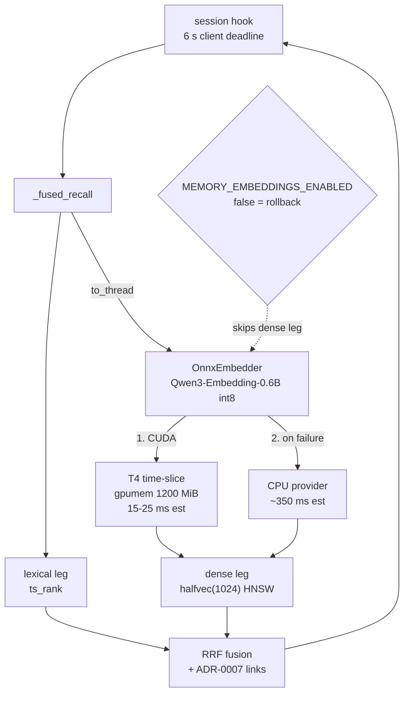

# Plan: GPU-served query embeddings for claude-memory recall

**Status:** approved, not started · **Date:** 2026-08-31 · **Owner:** Viktor Barzin

Recall currently spends most of its time embedding the query on a CPU, and about
one recall in fifteen takes longer than the client is willing to wait. This plan
moves the embedding to the Tesla T4 on `k8s-node1`, and takes the opportunity to
change the model to one that understands the Bulgarian content already in the
corpus.

## Why now

```stats
0.95 s | recall p50
4.98 s | recall p90
6.5 % | recalls lost to the 6 s deadline
9.2 % | memories containing Cyrillic
```

Measured on 2026-08-31 from the live pod and Prometheus, over 647 recalls across
the pod's 3d3h lifetime:

| | recall latency |
|---|---|
| p50 | 0.95 s |
| p90 | 4.98 s |
| p99 | ≥ 10 s |
| mean | 1.97 s |
| over 6 s, the hook's deadline | **6.5 %** of recalls (42 of 647) |
| over 10 s | 3.9 % (25 of 647) |
| server-side errors | 0 |

The server raises nothing. `memory_recall_errors_total` has never been
incremented. What fails is the client: `homelab-memory-recall.py` sets
`RECALL_TIMEOUT_S = 6`, so 6.5 % of recalls return nothing at all to the session.
`~/.claude/tmp/memory-recall-errors.log` holds 247 such timeouts since
2026-07-11, 35 of them in the three days to 2026-08-31.

Two measurements locate the cost:

- `embed_query` takes **0.25 s to 0.9 s** inside the pod. The image ships
  `torch 2.13.0+cpu` and `embeddings.py` pins `device="cpu"`, so every recall runs
  a 335M-parameter model on a CPU, which matches the observed p50 of 0.95 s.
- A cold model load takes **166 s**. Readiness is not gated on a warm model, so
  after any restart the first recalls exceed the deadline until the load finishes.

The tail above 6 s is less firmly explained. The pod averages 0.02 cores, shows no
CFS throttling, and `recall.py` already runs the embed off the event loop via
`asyncio.to_thread`, so the working hypothesis is CPU-bound embeds colliding on a
shared 8-core node. This plan does not depend on that hypothesis being right,
because an expected GPU embed of 15 ms to 25 ms sits far enough below the 6 s
deadline that contention on this scale would not reach it.

### A quality gap, separate from speed

`BAAI/bge-large-en-v1.5` is an English-only model. A 400-memory sample found
**9.2 % of memories contain Cyrillic**, mostly Bulgarian technical notes. Those
are currently embedded by a model with no representation for them, which the
lexical leg partly covers and the dense leg does not. Changing model addresses
this independently of latency.

The dense leg is worth keeping. `memory_recall_dense_only_top5_total` is 672
against 647 recalls, so on average more than one served top-5 result per recall
is one the lexical leg alone would not have surfaced.

## Decisions

Settled in the grilling session of 2026-08-31.

| # | Decision | Rationale |
|---|---|---|
| 1 | VRAM governance is out of scope | Handled by a separate agent. This plan treats free VRAM as a precondition for its final step only. |
| 2 | Model becomes `Qwen/Qwen3-Embedding-0.6B` | Native 1024-d, so `halfvec(1024)` and the HNSW index are unchanged. Apache-2.0. Multilingual, which addresses the 9.2 %. 509M parameters. |
| 3 | Serving is in-process `onnxruntime-gpu` | One library, one model artifact, provider list `CUDA` then `CPU`. `torch` and `sentence-transformers` are removed. Chosen for simplicity over a separate TEI service, accepting that requesting a GPU hard-pins the pod to node1. |
| 4 | CPU fallback is the same ONNX model on the CPU provider | One vector space, no ranking incoherence, and the fallback is the same code path with a different provider. |
| 5 | Re-embed is in-place over the existing column | No schema change is needed at 1024-d. |
| 6 | Rollback is `MEMORY_EMBEDDINGS_ENABLED=false` | An in-place re-embed leaves no old vectors to restore, so rollback uses the flag instead. `recall.py` documents that path as a true no-op to lexical FTS. |
| 7 | Model file is baked into the image | Pod start needs no network and no PVC; the version is pinned by the image tag. |
| 8 | Build behind the flag now, flip when VRAM frees | Decouples this work from the VRAM stream. |
| 9 | Declared budget is `viktorbarzin.me/gpumem: 1200` | ~500 MiB int8 weights, ~300 MiB CUDA context, plus onnxruntime arena and slack. |
| 10 | Target is recall p90 under 500 ms; the 6 s hook timeout is unchanged | Generous against an expected GPU p50 near 20 ms and a CPU fallback near 350 ms, so it fires on regressions rather than noise. |
| 11 | Alerting covers recall only | VRAM alerting belongs to the ADR-0016 stream. |
| 12 | The eval set gains a Cyrillic stratum | The multilingual claim gets measured rather than assumed. |

Two options were considered and not chosen. A dedicated
`text-embeddings-inference` service would keep claude-memory portable across
nodes, at the cost of a second deployment, an experimental Turing image, and two
numerically different embedding paths. A server-side deadline degrading to
lexical results would remove the silent-loss rate without any GPU work; the CPU
fallback was preferred because it keeps dense results available during a GPU
outage.

## Architecture



The shape of the recall path does not change. What changes is which backend sits
behind `embed_query`, and which device runs it.

## Phases

### Phase 1: the ONNX path, flag-off

1. Export `Qwen/Qwen3-Embedding-0.6B` to ONNX with int8 dynamic quantisation, and
   bake the artifact into the image.
2. Add an `OnnxEmbedder` alongside the existing backends, selected by env, with
   provider list `["CUDAExecutionProvider", "CPUExecutionProvider"]`.
3. Implement the model's own conventions, which differ from bge's:
   last-token (EOS) pooling rather than CLS, and the query format
   `Instruct: {task}\nQuery:{text}` with documents embedded raw. Both are
   test-covered, because getting either wrong yields plausible-but-wrong vectors
   rather than an error.
4. Remove `torch` and `sentence-transformers`. Measured during implementation:
   removing CPU torch saves roughly 800 MB of the current 1,232 MB image, but the
   CUDA and cuDNN libraries onnxruntime needs are 1.4 GB of wheels on their own,
   so the image grows rather than shrinks. Only the int8 graph is baked (~600 MB);
   fp16 for CUDA would add ~1.2 GB and is deferred until a measurement asks for it.
5. Gate readiness on one completed embed, so a restart never serves a cold model.
6. Add a `provider` label to the recall metrics, so GPU and fallback serving are
   distinguishable in Prometheus.

Deployable on its own. Running the CPU provider alone should take the embed from
0.25-0.9 s to an estimated 0.3-0.4 s.

### Phase 2: the eval gate

1. Extend `benchmarks/scripts/build_eval_set.py` with a `cyrillic` stratum drawn
   from the Bulgarian memories, generate queries and qrels, and have Viktor
   spot-check the relevance judgments before they gate anything.
2. Record a fresh bge-large baseline on the current corpus.
3. Run the harness against the ONNX backend. The gate is no statistically
   significant regression on nDCG@10 and recall@5 across `exact`, `paraphrase` and
   `multihop`, with the `cyrillic` stratum reported separately as the reason for
   the change.

### Phase 3: GPU flip and re-embed

> [!IMPORTANT]
> This is the only phase gated on the VRAM stream. Phases 1, 2 and 4 land
> independently.

Requires scheduling capacity. Declared budgets already total 13,984 MiB against
14,000 advertised, and the three measured tenants each peak above their own
declaration (llama-swap 6,992 against 5,000; immich-ml 3,264; frigate 2,713), so
there is no slack to reclaim from another tenant. The agreed route is to raise
advertised capacity to 15,200, declare 1,200 here, then tighten both numbers to
measured reality in a follow-up.

1. Add `nvidia.com/gpu: 1`, `viktorbarzin.me/gpumem: 1200`, the
   `nvidia.com/gpu.present` node selector and the GPU toleration, following the
   pattern in `stacks/tts/main.tf`. The Kyverno `inject-gpu-workload-priority`
   policy stamps `gpu-workload` priority automatically, since `claude-memory` is
   not in its exclude list.
2. Set `MEMORY_EMBEDDINGS_ENABLED=false`, so recall serves lexical results while
   the corpus is inconsistent.
3. Re-embed all live non-sensitive memories in place. Sensitive rows keep a NULL
   embedding, per ADR-0003.
4. Re-enable the flag and confirm the metric gate.

### Phase 4: alerting

Recall p90 above 500 ms, and any fallback-to-CPU serving, into `#alerts`. The
`memory_recall_seconds` histogram already exists and is scraped; nothing
references it yet.

## Correctness risks

> [!WARNING]
> Pooling and query-format mistakes do not raise. They produce vectors that look
> valid and rank badly, which is why phase 1 covers them with tests rather than
> review.

- **Pooling and instruct format.** A silent-failure risk, and the reason phase 1
  step 3 is test-covered rather than reviewed. Omitting the
  query instruct alone costs an estimated 1-5 % retrieval quality per the model
  card.
- **Mixed index during backfill.** Handled by serving lexical results for the
  duration rather than by tolerating a half-migrated index.
- **Node affinity.** Requesting a GPU pins claude-memory to `k8s-node1`, the node
  in `code-j3tx` where GPU pods went Pending after the 2026-07-18 reboot. The
  automatic `gpu-workload` priority means it should preempt the non-GPU workloads
  that caused that, rather than queue behind them. This is a change in the
  service's availability profile and worth watching after the first node1 reboot.
- **Quantisation.** int8 may cost retrieval quality. The phase 2 gate is what
  decides whether it is acceptable.

## Open questions

- CPU int8 latency (~350 ms) and GPU latency (15-25 ms) are estimates from model
  size, not measurements on this hardware. Phase 1 produces the first real
  numbers.
- The 1,200 MiB budget is an estimate. onnxruntime's CUDA arena behaviour on a T4
  under this workload is unmeasured, and the declaration is a hard reservation.
- The 9.2 % Cyrillic share comes from a 400-memory sample, not all 10,890.
- Whether the p90 tail above 6 s is fully explained by CPU contention. The GPU
  move should make it moot either way, and the `provider` label will show if
  something else is contributing.
- ADR-0003 and the docstrings in `embeddings.py` describe bge-large as the local
  backend. An ADR recording the model change belongs with the implementation.

## Out of scope

- VRAM governance sits with another agent. Correction (2026-09-01): an earlier
  draft of this plan said ADR-0016 decisions 2 and 3 were never built. They are
  both live — `gpu-vram-watchdog` runs as a Deployment in the `nvidia` namespace
  (not a CronJob, which is why a `get cronjob` check missed it) with
  `DRY_RUN=false` and `FLOOR_MIB=1536`, and the alerting exists as Loki rules in
  `monitoring/modules/monitoring/loki.tf`. What phase 3 needs from that stream is
  scheduling capacity, not new machinery.
- A server-side deadline degrading to lexical results. Considered, not chosen.
- Any schema or dimension change. Not needed at 1024-d.
