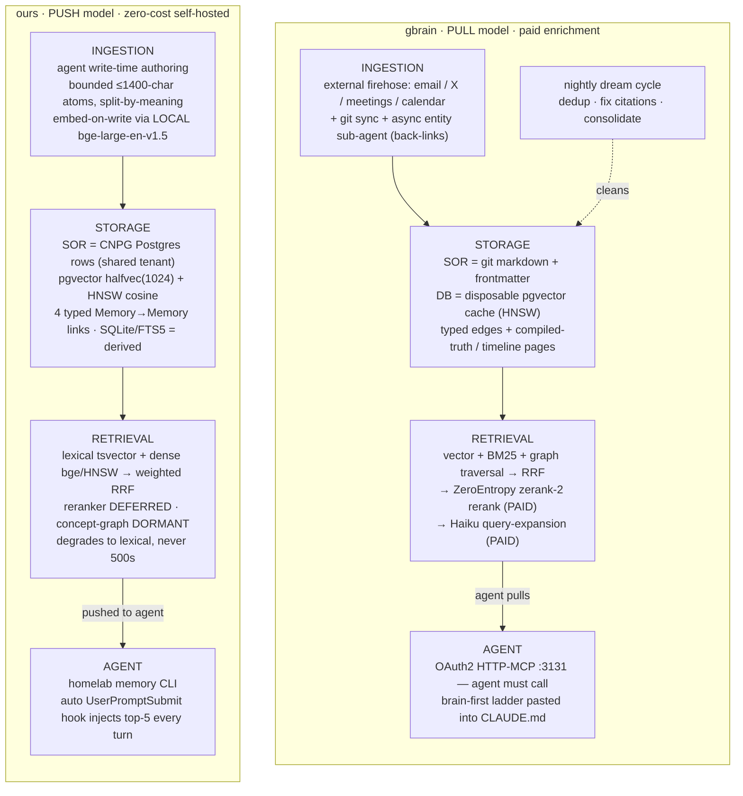

# gbrain vs. our claude-memory stack

> **Date:** 2026-07-17 · **Status:** Research / comparison (informational, with a ranked adoption backlog) · **Scope:** [garrytan/gbrain](https://github.com/garrytan/gbrain) vs. this repo's claude-memory service.
> **Method:** produced by a 27-agent Claude Code workflow — 10 parallel readers (7 over the gbrain repo, 3 over our ADRs / benchmark reports / live `homelab memory`) → 8 dimensions compared, each **adversarially fairness-checked** the moment it was built → one synthesis pass. gbrain facts are **self-reported** from its own docs (not independently verifiable from here); "ours" facts were **cross-checked** against live infra, code, and ADRs. That verification asymmetry is load-bearing and is flagged throughout.

*An honest, evidence-gated architectural comparison between **gbrain** — an entity-centric, git-backed "brain" knowledge graph — and **our self-hosted claude-memory** — a flat, bounded, zero-cost agent-memory service. Verdicts below honor the adversarial fairness review: where a dimension was ruled not directly comparable, it is presented as such, never as a clean win or loss.*

> **About gbrain:** MIT-licensed, written in Bun/TypeScript, source at `github.com/garrytan/gbrain`. Every gbrain fact in this report is self-reported from its own docs and was **not** independently verifiable from here; every "ours" fact was cross-checked against live infra, code, and ADRs. That verification asymmetry is load-bearing and is called out throughout.

---

## Executive summary

- **The retrieval cores are the same design.** Both systems independently converged on a single Postgres + pgvector + HNSW-cosine store with a lexical leg and a dense leg fused by Reciprocal-Rank Fusion (k=60) — **no separate vector DB on either side.** Every real difference is in what's layered on top and where the *system of record* lives.

- **The defining split is cost + delivery model.** gbrain buys quality with **paid external APIs** (OpenAI embeddings by default, ZeroEntropy `zerank-2` reranker, Haiku query-expansion and contradiction judge) and a **PULL** interface (agent must call MCP). Ours is **zero-cost self-hosted** (local `bge-large-en-v1.5`) and **PUSH** — recall fires automatically every turn via a hook, structurally solving cross-session forgetting, which is gbrain's *own* stated origin problem.

- **No head-to-head quality number exists, and no cited benchmark on either side is independently validated.** gbrain's headlines (97.60% recall@5 on LongMemEval-S; "+31 P@5 from the graph" on synthetic BrainBench) and ours (+0.350 paraphrase recall@10 on an internal 119-query set) sit on different corpora, metrics, k, and embedders. **Most dimensions are genuinely NOT-COMPARABLE**, not win/loss.

- **The knowledge-graph headline is not a contradiction.** gbrain's cheap *deterministic entity-edge* graph on 240 synthetic curated pages and our LLM/PPR *concept* graph found null on 5,452 real memories are different constructions on different corpora — and our own report explicitly scopes the null to the PPR-as-RRF-leg formulation and stages exactly the deterministic/reranker shape gbrain uses.

- **Ours has real, self-documented gaps:** no active contradiction/gap detection, ingestion-side rot (category twins that hid 97% of gotchas from exact-match), no production stage-2 reranker, a read path that ignores its own enforced per-user scoping, and stale interface docs pointing agents at retired MCP tools.

- **Ours is at least as strong or stronger where it counts:** guaranteed push-recall, zero-cost + sensitivity-aware self-hosting (secrets never embedded/egressed), graceful degradation as one code path (recall never 500s), additive/instantly-reversible rollout, and unusually rigorous, adversarially-audited engineering that caught and corrected its own false "graph is useless" claim.

---

## At-a-glance

| Dimension | gbrain | ours | Who's ahead |
|---|---|---|---|
| **Data model & system of record** | Git markdown+frontmatter is SOR; DB is a disposable, CI-rebuildable cache. Rich entity *pages* (compiled-truth + timeline), 15-type taxonomy, mention-graph | Postgres rows are SOR; SQLite/FTS5 is the only derived cache. Flat, bounded (≤1,400-char) *memories* + 4 behaviour-carrying typed links | **Not comparable** (git gives ours-beating content-change *auditability*) |
| **Storage engine & embeddings** | Pluggable PGLite (Postgres-in-WASM) / Supabase Pro ($25/mo); paid OpenAI embeddings by default → keyword-only without a key | Shared CNPG cluster (authoritative); local `bge-large` embedder (zero-cost); halfvec(1024)+HNSW; sensitive rows never embedded | **Not comparable** — ours cheaper on the embedding axis |
| **Retrieval / recall pipeline** | Maximalist: dense + BM25 + graph-leg → RRF → paid reranker + paid LLM expansion + intent router | Minimalist zero-cost two-leg hybrid (dense+lexical→weighted RRF); reranker deferred, graph dormant; degrades to lexical, never 500s | **Not directly comparable** — different objectives; gbrain's one real edge: it ships a stage-2 reranker |
| **Knowledge graph / self-wiring** *(headline)* | LLM-free deterministic entity edges, adjacency traversal as a live RRF leg; "+31 P@5" self-reported on 240 synthetic pages | LLM-typed concept graph + PPR, built + rigorously tested, **found graph-null** on 5,452 real memories, ships dormant; 4 live hand-authored typed links | **Indeterminate** — gbrain has an *untested design lead*, not a proven win |
| **Synthesis & gap analysis** | Stored compiled-truth synthesis + active contradiction probe (paid Haiku judge, Wilson-CI) + temporal taxonomy | Synthesis delegated to caller by design (thin store); no automated gap/contradiction detection | **Split**: synthesis is a design difference (tie) · gap-*detection* is a real gap (gbrain, presence only) |
| **Ingestion & consolidation** | Automated external firehose (email/X/meetings) + nightly "dream cycle" cleanup; paid tiered enrichment | Agent write-time authoring of bounded atoms; embed-on-write; no overnight job (verified absent) | **Not comparable** — cure-at-write vs clean-nightly; ours has a hygiene gap |
| **Multi-user scoping & access** | Single-owner brain; RLS deny-by-default vs the anon path; no per-human tenancy | Real multi-user (`user_id`, `memory_shares`/`tag_shares`); write/secret scoping enforced, **read path deliberately global** | **Not comparable** — access-control-without-tenancy vs tenancy-with-a-read-gap |
| **Agent integration & interface** | MCP-first PULL; 9 analytical MCP ops; OAuth2/spend-metering/SSRF for remote callers | CLI + automatic PUSH recall hook (guaranteed every turn); MCP deliberately retired | **Split**: breadth/security gbrain (unverified) · recall reliability ours |

---

## Architecture contrast

The two pipelines rhyme at the storage-and-fusion layer and diverge at both ends: **gbrain's truth is human-readable files cleaned by a nightly batch; ours' truth is Postgres rows kept coherent at write time.** **gbrain enriches with paid APIs and waits to be called; ours stays free and injects itself.**

---

## Dimension-by-dimension

### 1. Data model & system of record — *not comparable*

The role of the database is **inverted** between the two systems, and this is use-case-driven, not a quality gap. gbrain puts durable truth in a git repo of rich, human-editable entity **pages** (a REWRITE-on-change "compiled truth" over an APPEND-only immutable "timeline") and treats the DB as a disposable cache it rebuilds from the repo (`gbrain rebuild --confirm-destructive`). Ours puts durable truth in **Postgres rows** as flat, bounded (≤1,400-char) **memories** plus four behaviour-carrying typed links, with SQLite/FTS5 as the only derived cache.

**No scale or maturity inference is possible between them.** The corpus counts are cross-unit — unbounded pages/entities (gbrain cites *both* 17,888 pages *and* 186K pages in different docs, an unreconciled ~10× self-contradiction) versus ~9k bounded rows — so a "page" and a "memory" simply are not the same unit. Ours' own live figures (9,092/9,155 embedded; 5,214 link edges; an unexplained ~516-row stats-vs-DB delta) are point-in-time and non-reproducible.

**The one defensible directional claim is narrow: content-change auditability.** gbrain's git history + append-only-correction discipline genuinely beats ours' `homelab memory update`, which mutates in place and keeps *no content-diff history* except via `supersedes`. That is a property of git, not a benchmarked win — and it motivates a real *additive* opportunity (a markdown export mirror, below), **not** a replacement: Postgres-as-SOR remains right for live hybrid retrieval and zero-new-datastore reuse, and ours' flat bounded model is a deliberate, evidence-driven choice. Note that ours does **not** "already have gbrain's split implicitly" — the whole inverted point is that ours has no FS-canonical layer at all.

### 2. Storage engine & embeddings — *not comparable (ours cheaper on the embedding axis)*

On the **verifiable architecture the two converge** — one Postgres store + pgvector + HNSW cosine, no separate vector DB — but that convergence is live-confirmed only on ours' side (`bge-large-en-v1.5`, halfvec(1024), HNSW m=16/ef_construction=64, the 119-query gate, sensitive-NULL all verified in-repo). Every gbrain fact here is self-reported.

**Cost is genuinely asymmetric in ours' favour on the embedding axis:** free local embedder vs paid OpenAI-by-default (which degrades to keyword-only without a key). But the honest framing must not overclaim — gbrain's *DB* layer can be free too (PGLite / self-hosted), its $25/mo Supabase is an optional datastore tier, and ours' "zero cost" rides an *already-paid* shared cluster (sunk, not absolute-zero). **No embedding-quality ranking between OpenAI-emb and bge-emb is supportable** from the evidence; gbrain even self-reports an "embedding-invariant" precision floor (~0.09 raw cosine regardless of encoder size), which if true undercuts any paid-embedding advantage. Also worth flagging: ours' halfvec fp16 "halves index size at ~no recall loss" is an ADR-0006 *decision line*, not a measurement — ADR-0006's own consequences say ANN recall behaviour is "unmeasured … must be validated post-migration."

Caveat carried forward: **the "identical core" flattening hides substrate reality** — gbrain's PGLite is embedded Postgres-in-WASM (single-process, a local file); ours is a shared HA CloudNativePG cluster. "Byte-identical SQL" is not equivalent durability/concurrency/backup behaviour.

### 3. Retrieval / recall pipeline — *not directly comparable (different objective functions)*

Both share an **identical retrieval core** (dense HNSW + lexical + RRF k=60 on Postgres/pgvector), so on the core they are equivalent by construction. The only real question is whether gbrain's additive layers (stage-2 reranker, live graph leg, LLM query-expansion, intent routing) give a *net* benefit — and **no evidence-grounded quality ranking is possible**: there is no head-to-head number (gbrain's headline is on LongMemEval-S + synthetic BrainBench, which we never ran; ours is on an internal 119-query set gbrain never ran), and every cited benchmark on both sides is self-reported. So the raw comparison's "gbrain ahead" is **not defensible as stated.**

The honest verdict is different objective functions: gbrain leads only on *max-retrieval-quality-regardless-of-cost*, and even there the **sole well-founded gap is that it ships a stage-2 cross-encoder reranker we lack in production** — a broadly established quality lever. Its graph "load-bearing" claim is synthetic-only; its reranker's only cited evidence is a "reshuffles 60% of top-1" stat on n=20 (a *change* metric, not a relevance gain). On the axes **ours** targets — zero API cost, no paid external dependency, every-turn robustness, graceful degradation — ours leads by construction, and gbrain needs a paid OpenAI key or falls back to keyword-only.

The evidence-safe actions are the zero-cost ones: **ship the deferred LOCAL opt-in reranker** (closes the one real quality gap without breaching zero-cost or the p95 budget) and **run LongMemEval-S** so any future cross-system claim rests on a matched benchmark. Copying gbrain's paid stages or its graph is not supported by the evidence. (Note: ours' +0.350/+0.139 dense wins were cut on a frozen 5,452-memory / 119-query single-user corpus while the live store now holds ~9,155 — not guaranteed at current scale; and one fresh-post-compose dense re-gate remains **open**.)

### 4. Knowledge graph / self-wiring — *indeterminate (an untested design lead, not a win)* — see deep-dive

Split **design from outcome**. **Design (defensible):** gbrain occupies a quadrant we never tested and our own `hybrid-build-report.md §8` explicitly stages for future work — deterministic, zero-LLM, high-precision entity edges from explicit wikilink/typed-link structure, traversed by adjacency/seed-walk as a live RRF leg. That is a genuine, actionable design lead, and the cheap experiment is already staged (`graph_mode='1hop'` recursive-CTE reranker seeded from our trusted ADR-0007 typed links). **Outcome (not answerable on evidence):** no valid performance comparison exists — gbrain's "+31 P@5" is self-reported on a 240-page synthetic entity-prose benchmark with a different algorithm and edge semantics; our null is a rigorously scoped result for PPR-diffused *derived concept* edges on real operational-memory, and our source doc states that null does **not** generalize to a differently-shaped graph.

What stands: (1) we already capture the practical graph value (lifecycle/hygiene — supersede-redirect, resolved-by answer-attach) via live hand-authored typed links; (2) our self-wiring concept-graph + PPR approach returned a *solid, valid* null on our corpus; (3) gbrain's design points at an untested high-precision/adjacency alternative worth a scoped experiment. **Net: an incremental design lead to investigate, not a foundational loss** — and gbrain's headline win remains self-reported and unverified.

### 5. Synthesis & gap analysis — *split: synthesis tie (by design) · detection gap (gbrain, presence only)*

A single "gbrain ahead" overreaches; the dimension has two sub-axes. **Synthesis:** ours deliberately delegates synthesis to the calling agent (thin store; whole bounded memories retrieved), storing no compiled-truth artifact **by design** — a relocation of function, not a deficit. gbrain's synthesis verb (`think`) shows only weak, self-reported evidence (0.38 precision @ ~4.9s on a 77-case synthetic bench), so gbrain is **not demonstrably ahead on synthesis quality.**

**Gap/contradiction detection:** here is a genuine, correctly-identified capability gap — gbrain has an active contradiction/staleness/orphan probe suite (Wilson-CI headline rate, temporal verdict taxonomy, trajectory/scorecard) and ours has *none* (ours only *handles* staleness via human-authored supersedes/resolved-by links). Our own audit documents a concrete cost: the 53-minute rediscovery when symptom #5972 outranked root-cause #6775 for want of a `resolved-by` link. **But** gbrain's lead here is "built, at a cost, unproven at scale": it depends on a **paid** judge (`claude-haiku-4-5`) with no offline fallback, its headline "24%" rate is explicitly *illustrative* (not measured), and it is validated only at toy scale (77-case bench, n<30 guard) — roughly symmetric to our own built-but-disabled concept graph.

Defensible conclusion: **gbrain is ahead only on the *presence* of active gap/contradiction detection.** The one action that survives scrutiny is an adapted, **offline, human-in-the-loop, zero-cost** (in-cluster llama-cpp / bge, `is_sensitive`-excluded) detection probe emitting *paste-ready* supersedes/resolved-by suggestions — never auto-applied. Stored `think`-style synthesis is lower-priority and philosophy-incompatible with our thin store and the zero-cost rule.

### 6. Ingestion & overnight consolidation — *not comparable / tie by different design*

"gbrain ahead" conflates *more consolidation machinery* with *more coherent*. The two systems solve different problems: gbrain ingests an external multi-source firehose (email/X/meetings/calendar) and **consequently must** run a nightly batch "dream cycle" to stay coherent; ours ingests disciplined, agent-authored bounded atoms and is engineered to prevent incoherence at write time, so it deliberately runs **no** overnight consolidation. That absence is independently verified against the live repo (zero CronJob in the stack, zero dream/nightly/scheduler code, synchronous embed-on-write with no stale-embed job). gbrain's breadth, scale, job-count and timing figures (webhook <5s, autoskip=3, T1/T2/T3 call budgets, "20+ jobs") are all **self-reported design defaults**, not measured benchmarks.

The single fair, actionable finding: **ours has a real, documented, currently-unaddressed gap** — ingestion-side rot (category twins like `project`/`projects` and `reference`/`references` that the 2026-07-09 audit found hide 97% of gotchas from exact-match; potential dangling typed links) that write-time discipline provably does **not** catch. The defensible move is to adopt gbrain's contradiction-probe **pattern only**: a zero-cost, local-only, never-auto-mutating hygiene pass that *measures and surfaces* rot for the agent to resolve as a writing act — **not** gbrain's paid collectors/tiered enrichment (violate zero-cost) or its uptime-coupled crontab (strictly worse than ours' server-side infra + recall hook).

### 7. Multi-user scoping & access control — *not comparable*

The systems target different use-cases. gbrain is a **single-owner** personal brain ("not a multi-tenant service") whose access control hardens *one* owner's data against the unauthenticated Supabase anon/PostgREST path (deny-by-default RLS; gbrain's role holds `BYPASSRLS`) and against untrusted *remote agents* (read-only, world-visibility-only) — it has **no concept of multiple human users.** Ours is a **real multi-human-user** store (`user_id` per row, bearer-key→user_id auth, `memory_shares`/`tag_shares` resolved by `check_memory_permission`) that enforces write/delete/secret/stats scoping **but deliberately serves the every-prompt READ path globally** across trusted homelab users (`app.py:301` — "all memories are public"). This "ours" characterization is code-verified.

So **neither is "ahead"**: gbrain has access control *without* multi-tenancy; ours has multi-tenancy *with* an intentional read-isolation gap. The only defensible cross-system observation is an *internal-consistency* one about ours: **its read path does not match its own already-enforced write/secret scoping.** The adoptable fix is to gate `recall`/`list`/`get` with the existing `check_memory_permission` logic plus a per-row visibility tier (world/shared/private), **or** — if mutual read across homelab users is genuinely intended — promote it from an inline comment to a *documented, tested invariant.* (Framing guardrails from the review: gbrain does **not** give teammates login-scoped RLS slices; there is no gbrain fuzz-test or admin dashboard in the corpus; ours' "14 tenant readers" are DB tenants/other apps on the shared cluster, **not** claude-memory human users.)

### 8. Agent integration & interface — *split by axis*

Not a single-winner call. gbrain **plausibly** leads on agent-driven analytical **breadth** (higher-order read verbs: `find_orphans`, `find_anomalies`, `find_trajectory`, `get_recent_salience`, `find_experts`) and on a multi-client **security** surface (OAuth2, per-client spend metering, SSRF/DNS-rebinding hardening) — **but** that entire verb set is a WebFetch-summarizer paraphrase explicitly flagged for raw re-verification (unverifiable here; "30+ tools" is asserted, only 9 are named), and the security surface serves a remote/multi-tenant use-case ours deliberately lacks (homelab-internal, zero-cost), so it must **not** count against ours.

Ours leads — by the comparison's own admission — on the axis that most defines a memory system: **recall reliability.** Verified in live source: the UserPromptSubmit hook fires *unconditionally* (RECALL_LIMIT=10, INJECT_LIMIT=5, CONTEXT_BYTE_CAP=8000, per-session dedup, silent-fail), so cross-session forgetting is *structurally prevented* rather than left to agent discretion — solving gbrain's own origin problem more reliably than its protocol-dependent PULL. Two evidence-grounded actions survive: adopt only the low-cost analytical-read subset that maps to our facts/decisions corpus (find-orphans, a supersedes-chain trajectory view, a staleness surface — **after** re-verifying verb names against gbrain's raw source; drop `find_experts`, which maps poorly), and **fix the interface doc drift** (confirmed real: `recall.md`/`remember.md` still declare retired `mcp__claude_memory__memory_*` tools; `SKILL.md` still documents a defunct PreCompact/SQLite compaction architecture). Keep the push model; do not re-adopt MCP.

---

## Deep-dive: the knowledge-graph question

The most eye-catching line in any gbrain-vs-ours framing is that **gbrain reports a graph win (~+31 P@5) while our concept-graph was found NULL.** These results are **not in contradiction, and they are not directly comparable.** Here is the honest reconciliation.

**First, the figure itself.** It is cited variously as **+31.4** (the task framing), **"+31 P@5 points"** (gbrain's corpus), and **~31.1** (reconstructed as full-stack 49.1 − graph-disabled ~18). All three are the same self-reported result on **BrainBench: a 240-page Opus-*generated* synthetic corpus scored by a self-run harness — never validated on real user data.** gbrain's own docs are also internally inconsistent about what the graph even *is*: `entity-detection.md` says "NO relationship inference — mention graph only," while `RETRIEVAL.md` says "typed semantic edges (`works_at`/`invested_in`) extracted **LLM-free** via 3 regexes + heuristic sentence-context inference." The "high-precision" characterization is asserted from the mechanism; **no precision measurement is cited anywhere.**

The two results differ on **every axis that matters**:

| Axis | gbrain's "+31 P@5" | our "graph-null" |
|---|---|---|
| **Corpus** | 240 curated, Opus-*generated* synthetic entity-prose pages | 5,452 **real** homelab memories (~2 orders of magnitude larger, real provenance) |
| **Edge semantics** | Deterministic edges over explicit wikilink/typed-link syntax (asserted high-precision) | LLM/embedding-**derived** concept co-occurrence edges (measured noisy) |
| **Algorithm** | Adjacency / seed-traversal, merged via RRF | Personalized PageRank **diffusion** |
| **Domain / query mix** | Entity/world-knowledge — the point is multi-hop relational ("walk `bob –invested_in→ company –dated→ Q1`") | Operational memory, where entity-relational multi-hop may be **intrinsically rare** |

Our null was reached *rigorously*, not conveniently: the first benchmark's "graph is useless" ablation was caught by an adversarial completeness review as a **mathematical artifact** (the fusion config structurally barred graph-only candidates from the fused top-k), and only *after* fixing the fusion (shared candidate pool, PPR seed-lockout fixed, weight swept to 5.0, **737 graph-only ids genuinely competing** in the top-10) and running paired-bootstrap CIs did `+both` (dense+graph) fail to beat `+dense` on any stratum at any weight — including the entity-bridged multi-hop "sweet spot." The mechanistic root cause is a **precision/coverage tension**: the PPR leg is either silent (harmless, useless) or loud (floods low-precision bridged neighbours; nDCG@10 collapses to 0.19 at w=2.0).

**Would gbrain's result transfer to our corpus? Unknown, and untested.** Its claimed win depends on exactly the two things we did **not** try: (a) high-precision **deterministic** edges from explicit structure, and (b) **adjacency** traversal instead of PPR diffusion (the mechanism that flooded neighbours and forced our null). Our own `hybrid-build-report.md §8` explicitly scopes the null to "the graph-as-RRF-leg formulation with PPR seeding" and states it "does not rule out a differently-shaped graph contribution (precision-filtered candidates, reranking rather than fusion)" — **which is precisely gbrain's shape.** But our corpus is operational homelab memory, not entity-centric world knowledge, so the query distribution that makes an entity graph pay off may simply be rarer here.

**Bottom line:** a synthetic-only, self-reported win on a small curated entity corpus does not disprove our valid null on a real operational corpus, and our null does not disprove gbrain's approach on its own domain. The two coexist. Meanwhile, ours already banks the *practical* value a graph is usually built for — tombstoning (supersede-redirect) and answer-attachment (resolved-by) — via live hand-authored typed links, with **neither** graph enabled. The right posture is a **scoped experiment** (the staged `graph_mode='1hop'` deterministic reranker over our trusted typed links), not an assumed win and not an assumed loss.

---

## What we could adopt

Ranked highest-value / lowest-cost / least-duplicative first. Each gated against the three homelab rules — **(i) reuse-before-building, (ii) zero-NEW-cost, (iii) bounded-memory-model fit.**

### 1. Fix the interface doc drift — **Effort: S**
`skills/memory-management/SKILL.md`, `commands/recall.md`, and `commands/remember.md` still instruct agents to call the **retired** `mcp__claude_memory__memory_*` tools and describe a defunct PreCompact/SQLite compaction architecture. This *actively misleads any agent that reads them.* Pure correctness, highest value for lowest cost.
- **(i) Reuse:** yes — a documentation repair, builds nothing.
- **(ii) Zero-cost:** yes.
- **(iii) Fits model:** yes — it *is* the model's interface docs.

### 2. Reconcile the recall read-scoping gap — **Effort: S–M**
The every-prompt read path (`_lexical_recall`/`_dense_recall`/`list_memories`/`get_memory`) serves all users' non-sensitive rows and never joins the shares tables, while write/delete/secret paths already enforce `check_memory_permission`. Either gate reads with the existing resolver + a per-row visibility tier (world/shared/private, mirroring gbrain's `stripFactsFence`), **or** — if shared homelab read is intended — promote it from an inline comment to a *documented, tested invariant.* Closes a latent cross-user read exposure / internal inconsistency.
- **(i) Reuse:** strong — `check_memory_permission`, `memory_shares`/`tag_shares` already exist; it's a WHERE-clause change, not new infra.
- **(ii) Zero-cost:** yes.
- **(iii) Fits model:** yes — adds a visibility column, no new entity.

### 3. Zero-cost offline memory-hygiene + contradiction probe — **Effort: M**
A scheduled/on-demand, **human-in-the-loop, never-auto-mutating** pass that (a) clusters near-duplicate category twins and emits paste-ready merge suggestions — directly attacking the *one documented ingestion-side drift write-time discipline provably misses*; (b) flags dangling typed links (the "fix broken citations" analog); (c) pairs candidate memories via existing hybrid retrieval and proposes `supersedes`/`resolved-by` links, judged by the **in-cluster llama-cpp/bge model** (never the paid Haiku). Borrow gbrain's Wilson-CI + temporal-verdict *framing*; would have caught the #5972-vs-#6775 rediscovery. **Closes two real gaps at once** (no gap-detection + ingestion rot).
- **(i) Reuse:** strong — links table + dormant concept-graph substrate + hybrid retrieval + human-in-the-loop culture already exist.
- **(ii) Zero-cost:** yes — **explicitly substitutes local models for gbrain's paid `claude-haiku-4-5` judge.** (Caveat: a small local judge may not match a hosted one — validate quality before relying on it.)
- **(iii) Fits model:** yes — output is *suggestions* to author supersede/resolved-by links; "supersede is a writing act."

### 4. Ship the deferred LOCAL opt-in cross-encoder reranker — **Effort: M**
`bge-reranker-v2-m3` on the GPU node (already scoped in ADR-0005 / integration-design A.6) as an **opt-in "high-detail" recall mode** over the fused top ~20–30. Closes the single biggest pipeline gap (no production reranker) — gbrain's one well-founded retrieval edge — without touching the fast, free every-turn hot path.
- **(i) Reuse:** yes — already designed and deferred; no new research.
- **(ii) Zero-cost:** yes — **local model, explicitly NOT gbrain's paid ZeroEntropy `zerank-2`.**
- **(iii) Fits model:** yes — reranks whole bounded memories; keep it off the p95 hot path.

### 5. Add analytical read verbs — **Effort: M**
Expose a small higher-order read set so an agent can *mine* memory, not just receive auto-recalled rows: **find-orphans** (unlinked memories needing curation), a **supersedes-chain trajectory** view (how understanding of X evolved), and a **staleness/contradiction surface** (overlaps with #3). Drop gbrain's people-centric `find_experts` (poor fit for a facts/decisions/gotchas corpus). Optional free extras from gbrain: a deterministic no-LLM intent classifier and a typed per-hit evidence contract.
- **(i) Reuse:** strong — live 5,214-edge typed-link graph; `get <id>` already returns links both directions. **Re-verify gbrain's exact verb names against its raw source first** (they are unverified summarizer paraphrases).
- **(ii) Zero-cost:** yes — SQL/CTE over existing tables, no model calls.
- **(iii) Fits model:** yes.

### 6. Additive markdown+frontmatter git export of the non-sensitive corpus — **Effort: M–L**
A periodic export (filtered by `is_sensitive`) to a git repo — giving free version history, human inspection/edit, portability, and **CNPG-independent disaster recovery**, plus the content-change *auditability* that is gbrain's one defensible SOR advantage over our in-place `update`. A **mirror, not a replacement** — Postgres stays the SOR.
- **(i) Reuse:** yes — `is_sensitive` filter + git infra already exist.
- **(ii) Zero-cost:** yes.
- **(iii) Fits model:** yes — bounded memories serialize cleanly to one file each.

### 7. Codify a rebuild-from-canonical E2E gate + run LongMemEval-S — **Effort: M**
A CI test that **drops the derived embedding/HNSW/`search_vector` layers, re-embeds from the authoritative `memories` table, and re-runs the 119-query regression gate** — hardening the existing "additive/reversible" claim against silent derived-layer drift. Separately, run **LongMemEval-S** so our retrieval has an externally-comparable number instead of only an internal set. (Justify on ours' own terms — our table is authoritative, not a cache — **not** on gbrain's unverified `system-of-record-invariant.test.ts`.)
- **(i) Reuse:** strong — post-cleanup regression gate + backfill tooling already exist.
- **(ii) Zero-cost:** yes — local embedder, no external harness dependency.
- **(iii) Fits model:** yes.

---

## What we already do as well or better / should NOT copy

**Keep — ours is at least as strong here:**
- **Guaranteed push-recall.** The automatic UserPromptSubmit hook injects the top-5 unseen memories every turn under an 8KB budget with per-session dedup and silent-fail — structurally preventing cross-session forgetting. This solves gbrain's *own* origin failure more reliably than its protocol-dependent brain-first ladder. **Keep the push model; do not re-adopt MCP.**
- **Zero-cost, sensitivity-aware self-hosting.** Local `bge-large` on the already-shared CNPG cluster; **sensitive rows never embedded or egressed** (NULL vector, lexical-only). gbrain's default path *requires* a paid OpenAI key or drops to keyword-only.
- **Graceful degradation as one code path.** Weighted RRF collapses to exact lexical ordering when dense/graph legs are empty, and any dense failure is swallowed to lexical — recall (fired every turn) **never 500s.**
- **Additive, instantly-reversible rollout.** The whole dense leg is one flag-gated Alembic migration; the original lexical `search_vector`+GIN is untouched; rollback is flipping `MEMORY_EMBEDDINGS_ENABLED=0`.
- **Bounded self-contained memories + typed links with defined recall semantics.** The 1,400-char cap guarantees whole-memory delivery; `supersedes` redirects stale vocabulary to current truth and `resolved-by` auto-attaches the answer — delivering much of a graph's practical value (tombstoning, answer-attachment) *without* the unproven concept graph.
- **Adversarially-audited engineering.** The ADRs contain dated, in-place corrections of the system's *own* earlier false claims (the "Immich runs pgvector," "CC was benchmarked," and graph-"null" errors), paired-bootstrap CIs, and de-bolded non-significant results. This intellectual-honesty discipline is a genuine differentiator.

**Do NOT copy:**
- **Any paid dependency** — OpenAI `text-embedding-3-large` (default embedder), ZeroEntropy `zerank-2` (reranker), `claude-haiku-4-5` (contradiction judge), Voyage multimodal (0.12¢/image). All violate the zero-cost rule; every capability we adopt from gbrain must be re-implemented on local models.
- **gbrain's multi-source external collectors + tiered paid enrichment** (email/X/meetings/calendar; Brave/Crustdata/Happenstance/Captain) — violate zero-cost *and* the agent-authored-memory model.
- **A 20+-job crontab coupled to machine uptime** — strictly worse than ours' server-side infra + recall hook.
- **The "graph is load-bearing" claim** — we built and *validly* tested a richer graph and found it null on our corpus; re-open only with a differently-shaped, precision-filtered or rerank-style formulation.
- **Stored compiled-truth synthesis / a `think` verb** — cuts against ours' deliberate thin-store philosophy (synthesis in the caller) and the zero-cost rule, and gbrain's own evidence for it is weak (0.38 precision @ ~4.9s).
- **gbrain's full git-as-SOR model** (DB as disposable cache) — Postgres-as-SOR is right for live hybrid retrieval + zero-new-datastore reuse; take only the *additive* markdown-mirror slice (item #6).
- **gbrain's rich entity/type taxonomy** — ours' flat model is a deliberate, evidence-driven win for agent-operational memory.

---

## Verdict

These are two well-built systems optimizing for different worlds, and an honest scorecard refuses a single winner. **gbrain** is a portable, git-versioned, entity-centric "brain" that buys retrieval and analysis quality with paid APIs and waits to be called — excellent for human-editable, auditable world-knowledge, but cost-incompatible with our constraints and, on close reading, resting on self-reported benchmarks and a self-contradictory scale/taxonomy story. **Ours** is a zero-cost, self-hosted, sensitivity-aware agent-memory service whose flat bounded model and automatic push-recall structurally guarantee the thing a memory system exists to do — remembering across sessions — with unusually rigorous, self-auditing engineering behind it. The two converge exactly where it's smart to (one Postgres + pgvector + HNSW + RRF core) and diverge exactly where their goals differ. gbrain has *one* well-founded retrieval edge (it ships a reranker we deferred) and *one* real capability we lack (active gap/contradiction detection); it also points at an untested, high-precision deterministic-graph design worth a scoped experiment. All of those are adoptable **on our own terms** — local models, human-in-the-loop, additive and reversible — and none require abandoning what we already do better. The highest-leverage next moves are the cheapest: fix the misleading interface docs, reconcile the read-scoping gap, and stand up a zero-cost local hygiene/contradiction probe. **Not "gbrain wins" or "ours wins" — a use-case-dependent split, with a clear, zero-cost path to close every gap that survives scrutiny.**
